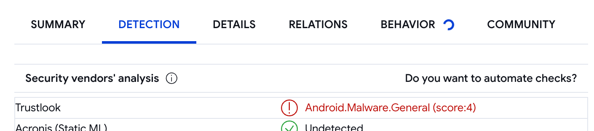

# Writeups for our Android app analysis for SOEN 321 

# Not Working
- Dream AI
- AI Girlfriend
- AI Anna

# Working
## EVA AAI
## iGirl
## HER ai

### General Observations
- It seems to process on the device as chatting generates no Burp traffic.
- Interesting behavior: it completely refuses naughty talks instead of prompting you to pay like most apps.

## SuperBetter

### VirusTotal
- Every security vendor returns clean except one; this could be a false positive 

### Burp Suite
- This app sends everything, including passwords, in plaintext during registration 

## ???

### Burp Suite
- This app sends chat queries and responses in plaintext 

# Dismissed
- LoveGPT
  - Reason: It requires a Google account, which needs a phone number, and we refuse to use our own as Google can detect fakes.

---

# Resources

## Burp Suite

- Working on Pixel 7 Pro and API 30: [Setup Guide](https://blog.yarsalabs.com/setting-up-burp-for-android-application-testing/)
- Working on Pixel 2XL API 28: [Setup Guide](https://archive.is/dUpPZ)

## MobSF 

- **Documentation**: [MobSF Docs](https://mobsf.github.io/docs/#/)
- **MobSF Instructions with Docker (Minh)**:
  1. Install Docker `winget/brew/apt install docker`
  2. Verify Docker with `docker --version`.
  3. Run `docker pull opensecurity/mobile-security-framework-mobsf:latest` to create a container.
  4. Run `emulator -writable-system -avd Pixel_2_XL_API_28` to launch the AVD.
  5. Run `adb devices` to get the ID of the AVD (in the form of "emulator-[number]").
  6. Run `docker run -it --rm -p 8000:8000 -p 1337:1337 -e MOBSF_ANALYZER_IDENTIFIER=<emulator_id> opensecurity/mobile-security-framework-mobsf:latest`.
     (Emulator_id was obtained in step 5)
  7. MobSF will launch at `localhost:8000`, and static and dynamic analyzers should work.
